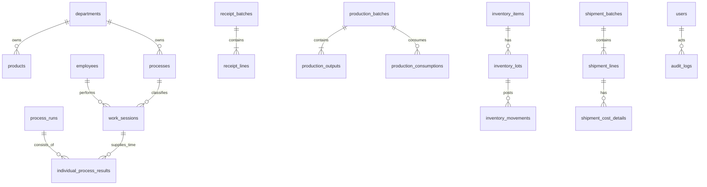

# ④ DB設計

## 方針

- Node.js 22系＋SQLite。現行工程管理アプリのDB初期化、マイグレーション、バックアップ方式を流用する。
- 重量は整数gを正本とし、入力・保存・API・画面表示でkgへ自動変換しない。個数等の非重量数量は単位を必須にする。
- 金額は円整数、業務日はJSTの`YYYY-MM-DD`、監査日時はUTC ISO 8601とする。
- 物理削除せず、取消・無効化・訂正履歴を残す。
- 在庫残は `inventory_movements` の合計を正本とし、キャッシュは再構築可能にする。
- Dashboard値と集計値は原本テーブルから再計算可能にし、直接編集可能な集計正本テーブルを作らない。

## 関係概要

## マスタテーブル

|テーブル|主要列|
|---|---|
|users|id, username, display_name, active, created_at, updated_at（認証用アカウントではなく操作記録用の内部実行者）|
|departments|id, code(`lotus`,`produce`), name(`れんこん`,`青果`), active, sort_order|
|employees|id, code, name, department_id, line_user_key(nullable), active|
|labor_cost_rates|id, employee_id, rate_type(`hourly`,`monthly_management`), salary_amount(nullable), weekday_count(nullable), hours_per_day, rate_amount, effective_from, effective_to, source_note|
|processes|id, code, name, department_id, allocation_target, dashboard_role(nullable), standard_minutes, input_item_type, output_item_type, active, sort_order|
|inventory_items|id, code, name, item_type(`raw`,`processed_lotus`,`semi_finished_chips`,`finished`,`flavor`,`packaging`), department_id, storage_unit, display_unit, inventory_managed, active|
|products|id, code, name, department_id, content_amount, content_unit, flavor_id, sales_unit, standard_price, standard_cost, inventory_item_id, active|
|flavors|id, code, name, inventory_item_id, stock_unit(`bag`), active|
|partners|id, code, name, partner_type, payment_terms_days, receipt_terms_days, active|
|product_packaging_components|id, product_id, packaging_item_id, quantity_per_product, effective_from, effective_to, active|
|locations|id, code, name, department_id, active|
|units|code, name, dimension, to_base_factor, decimal_places, active|
|system_settings|key, value_json, updated_by, updated_at|

既存IDを `legacy_id` として各移行対象マスタに保持し、名称ではなくIDで照合します。

## 取引テーブル

|テーブル|目的・主要列|
|---|---|
|receipt_batches|id, receipt_date, partner_id, department_id, status, source_type, external_id, memo|
|receipt_lines|id, batch_id, item_id, lot_no, quantity, unit, amount, expiry_date|
|process_runs|id, work_date, department_id, process_id, input_item_id, output_item_id, input_lot_id, output_lot_no, before_qty, after_qty, unit, waste_qty, started_at, ended_at, break_minutes, status, memo|
|individual_process_results|id, process_run_id, employee_id, input_lot_id, input_qty_g, waste_qty_g, output_qty_g, work_session_id, calculated_minutes, time_source(`line`,`manual_exception`), memo, status|
|production_batches|id, production_date, department_id, lot_no, started_at, ended_at, status, source_type, external_id, memo|
|production_consumptions|id, batch_id, item_id, inventory_lot_id, quantity, unit, consumption_type(`material`,`flavor`,`packaging`)|
|production_outputs|id, batch_id, product_id, item_id, completed_weight_g, completed_count, count_unit, defect_qty, waste_qty|
|shipment_batches|id, delivery_date, physical_shipment_date(nullable), department_id, partner_id, shipment_type, settlement_type(`receivable`,`cash`), payment_status, due_date(nullable), status, external_id, memo|
|shipment_lines|id, batch_id, product_id, inventory_lot_id, quantity, unit, unit_price, sales_amount, direct_cost_amount, gross_profit_amount, cost_snapshot_at|
|shipment_cost_details|id, shipment_line_id, cost_type(`raw_material`,`flavor`,`packaging`,`outsourcing`,`other_direct`), source_type, source_id, amount, calculation_note|
|work_sessions|id, employee_id, department_id, process_id, work_date, started_at, ended_at, break_minutes, minutes, source_type(`line`,`web`), start_external_id, end_external_id, status|
|work_session_costs|id, work_session_id, labor_cost_rate_id, process_id, minutes, labor_cost_amount, calculated_at|
|production_cost_pools|id, production_batch_id, pool_type(`chips_total`,`department`,`other`), department_id, name, status|
|process_labor_cost_allocations|id, cost_pool_id, process_id, work_session_cost_id, allocated_amount|
|flavor_recipes|id, flavor_id, name, effective_from, effective_to, active|
|flavor_recipe_components|id, recipe_id, inventory_item_id, standard_quantity_g, allocation_rule(nullable)|
|outsourcing_costs|id, occurred_on, amount, scope_type(`company`,`department`,`flavor`), department_id(nullable), flavor_id(nullable), source_id, memo|
|inventory_lots|id, item_id, lot_no, location_id, received_or_made_on, unit_cost, expires_on, created_at|
|inventory_movements|id, lot_id, occurred_at, business_date, movement_type, quantity_delta_base, source_type, source_id, department_id, unit_cost, memo|
|stocktakes|id, stocktake_date, department_id, status, confirmed_by, confirmed_at|
|stocktake_lines|id, stocktake_id, item_id, lot_id(nullable), book_qty, actual_qty, difference_qty, reason|
|daily_closures|id, business_date, department_id, status, confirmed_by, confirmed_at, reopened_by, reopen_reason|
|receivables|id, shipment_batch_id, partner_id, recognized_on, original_amount, outstanding_amount, due_date, status|
|payments|id, partner_id, received_on, amount, payment_method, external_id, memo|
|payment_allocations|id, payment_id, receivable_id, allocated_amount|

個人別加工実績から工程別集計を生成する場合も、個人行を原本として追跡できる関連を保持します。工程集計値を直接修正せず、修正は原本実績へ理由付きで行います。

## 共通・連携・監査

|テーブル|目的|
|---|---|
|idempotency_keys|更新リクエストの重複排除|
|external_events|LINE/OCR/n8nの受信原文、外部ID、処理状態、エラー。LINEはPhase1|
|import_jobs / import_errors|CSV取込履歴と行別エラー|
|export_history|CSV・帳票出力履歴|
|audit_logs|操作者、操作、対象、変更前後JSON、理由、日時|
|schema_migrations|適用済みDB版|
|backup_history|バックアップ・復元確認履歴|

## 制約

- `before_qty >= 0`, `after_qty >= 0`, `waste_qty >= 0`, `break_minutes >= 0`
- 終了は開始以降。算出分数が負になる登録は禁止
- `process_run_workers` の従業員重複は禁止
- activeな同一コードは一意
- 確定済み日次データの更新は再開理由必須
- 在庫移動後残高が負になる更新は禁止
- `source_type + external_id` は外部入力元内で一意
- 従業員ごとの同時進行中LINEセッションは原則1件。例外運用は管理者が監査付きで処理
- 新規個人加工実績は使用量・破棄・出来高を整数gで保持する
- LINE連携後の通常登録で`time_source=manual_exception`を受け付けず、管理者例外APIだけに限定する
- 完成品の`completed_weight_g`と`completed_count`を別値として保持し、一方から他方を原本として上書きしない
- `settlement_type=receivable`は売掛連携対象、`settlement_type=cash`は登録時点で入金済みとする
- 出荷確定時の商品別直接原価を明細として保存し、後のマスタ変更で当時の粗利を無断変更しない
- 包材仕入ロットの単価は`receipt_lines.amount ÷ receipt_lines.quantity`で算出し、数量0は禁止する
- チップス端数は廃棄移動ではなく、半製品在庫品目への正の在庫移動として記録する
- 売上認識日は納品日とし、現金は同日回収済み、売掛は`receivables`を生成する
- 売掛消込総額が売掛残高または入金額を超える更新は禁止する

## 単位保存方針

- 原料・加工済みれんこん・チップス半製品・完成重量等の重量は整数gで保存する
- 完成チップスは完成重量gと袋数を別列で保持し、どちらかを他方で上書きしない
- 包材は個数の整数
- フレーバー在庫の新規原本単位は味別の袋数とする。既存フレーバーマスタ・在庫データから袋数への移行対応は実データ照合後に確定し、換算根拠のない値を合算しない
- 画面重量もgで表示し、kgへの自動表示変換を行わない

## Dashboard用データ構造の原則

- 工程フローは`processes.sort_order`と実績の関連で構成し、画面コードへ工程名・順序を固定しない。
- 加工投入量と最初の工程投入量が同じ原本行を指す場合、別の集計値として複製しない。
- 完成重量と完成数量は`production_outputs`から工程フロー終点へ表示する。
- 商品別完成品在庫は商品に紐づく在庫移動を袋数で集計する。
- 味別フレーバー在庫は`flavors`に紐づく在庫品目の袋数で集計する。
- Dashboard表示専用の手入力列・テーブルは設けない。

## Phase1工程初期値

|部門|sort_order|name|dashboard_role|
|---|---:|---|---|
|れんこん|1|入荷|null|
|れんこん|2|水煮加工|`primary_process`|
|れんこん|3|チップス加工|`primary_process`|
|れんこん|4|納品準備|null|
|れんこん|5|配達・納品|null|
|青果|1|収穫|確認待ち|
|青果|2|選別・袋詰め|確認待ち|
|青果|3|納品準備|null|
|青果|4|配達・納品|null|

完成品と出荷は工程マスタ行ではなく、製造完成実績と納品実績から工程フロー終端へ表示する。

## 労務費配賦

- 工程マスタを労務費集計単位とし、作業セッションは工程ID必須とする。
- 工程別労務費は、作業セッションに適用した賃率と時間のスナップショットから再現可能にする。
- チップス関連労務費は`production_cost_pools.pool_type=chips_total`へ集約し、フレーバー・内容量・SKUへ細分配賦しない。
- 時給者は適用時間単価×作業時間で計算する。月給者の管理時間単価は月給÷当月平日日数÷8で算出し、給与計算には使用しない。
- 将来の製品化（袋詰め）工程は`processes`への行追加と表示順変更だけで対応する。

## 原料・外注費の拡張

- 直接使用原料は製造消費ロット単価を直接原価へ計上する。
- 共通フレーバー原料に備えて、有効期間付きフレーバーレシピと構成明細を持つ。`allocation_rule`はヒアリング確定まで未設定を許可する。
- 外注費は会社共通、部門、特定フレーバーの対象区分と関連IDを保持する。自動配賦式は持たず、部門損益・商品原価側が対象区分を参照できるようにする。

## 包材原価・在庫

- 包材仕入時にロット別単価を自動算出して`inventory_lots.unit_cost`へ保持する。
- 商品別包材構成は有効期間付きで保持し、製造時の実使用数量を`production_consumptions`へ記録する。
- 商品包材原価は使用ロット単価×実使用数量を原則とし、標準使用数量との差異を確認可能にする。
- 包材は通常の在庫移動・棚卸対象とする。

## 売上・売掛

- `shipment_batches`の業務日は納品日を正本とする。物理出荷日を別途必要とする場合は任意項目として保持する。
- 現金販売は納品日に売上計上し、同額の回収済み状態を記録する。
- 売掛販売は納品日に`receivables`を作成し、入金予定日・残高・消込履歴を保持する。
- 資金繰りアプリ連携後も、本システム内の納品・売掛・入金対応を追跡できる外部IDを保持する。

## 既存シートからの移行対応

|既存|新DB|
|---|---|
|M_商品|products＋inventory_items|
|M_部門|departments（2タブへの対応表を付与）|
|M_工程|processes|
|M_取引先|partners|
|M_従業員|employees|
|M_フレーバー|flavors|
|T_仕入|receipt_batches / receipt_lines / inventory_movements|
|T_工程|process_runs|
|T_工程_担当者|process_run_workers|
|T_製造|production_batches / consumptions / outputs|
|T_売上・委託出荷|shipment_batches / shipment_lines|
|T_勤怠|work_sessions|
|A_在庫|移行開始残高としてinventory_lots / movementsへ投入|
|A_分析各種|移行せず原本から再計算し照合|
|LOG|監査参照用アーカイブ。新規はaudit_logs|

## 原価・資金繰り連携の確定範囲

- 本システム内の原価は、商品へ直接紐付く費用に限定する。
- 原料、フレーバー、包材、外注費等の明細を保持できるようにする。
- 油等の月次費用および経営全体の原価は部門損益アプリの管理対象とし、本DBへ重複計上しない。
- 資金繰りアプリへは、出荷ID、納品日、取引先、売掛／現金、売上金額、入金予定日、売掛残高、入金状態、外部連携IDを渡せるようにする。
- 原価のロット評価方法、端数、外注費の配賦単位、連携APIの具体形式は未確定であり、既存ロジックと連携先仕様の確認後にレビューする。

既存Excelは27シート版で、`T_経費`と`A_工程ロス`がなく、`T_仕入`・`T_工程`の末尾ヘッダーも欠けています。コミット`b13e06f`の`migratePhase2Schema()`も工程列の修復とA_工程ロス作成を行わないため、移行済みと仮定しません。移行処理はシート名だけで版を決めず、ヘッダー集合・列数・登録日時・ログを使って版を判定します。意味を確定できない行は`import_errors`へ保留し、本番取引へ書き込みません。

## 索引

業務日＋部門、品目＋ロット、工程＋業務日、従業員＋業務日、出荷日＋商品、外部ID、監査日時に索引を設けます。ダッシュボードは日・週・月の期間条件で原本を集計し、件数増加後のみ日次集計キャッシュを追加します。
