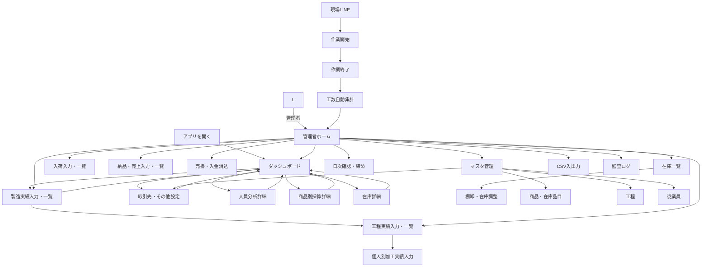
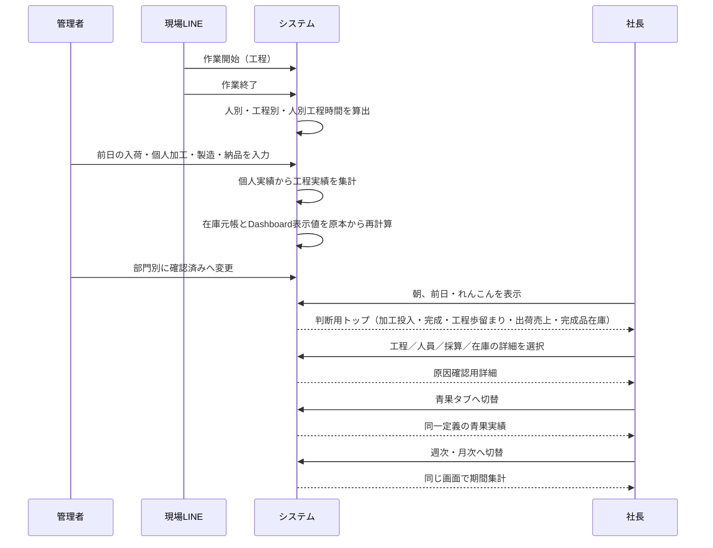

# ⑥ 画面遷移図

Phase2Aは三本線メニューから管理3画面へ遷移し、初回だけ管理者PINを確認する。LINEは「未登録→登録コード→待機→作業中→休憩中→作業中→終了」の状態遷移とし、休憩中および作業中の別工程開始を拒否する。

```mermaid
flowchart TD
  O["アプリを開く"] --> D["ダッシュボード"]
  D --> M["三本線メニュー"]
  M --> D
  M --> P["工程実績入力"]
  D --> PA["工程分析詳細"]
  D --> WA["人員分析詳細"]
  D --> PF["商品別採算詳細"]
  D --> ID["在庫詳細"]
  PA --> D
  WA --> D
  PF --> D
  ID --> D

  L -->|管理者| H["管理者ホーム"]
  H --> R["入荷入力・一覧"]
  H --> P["工程実績入力・一覧"]
  P --> IP["個人別加工実績入力"]
  H --> M["製造実績入力・一覧"]
  H --> S["納品・売上入力・一覧"]
  H --> AR["売掛・入金消込"]
  H --> I["在庫一覧"]
  I --> T["棚卸・在庫調整"]
  H --> C["日次確認・締め"]
  H --> D
  H --> MS["マスタ管理"]
  MS --> PR["商品・在庫品目"]
  MS --> PC["工程"]
  MS --> EM["従業員"]
  MS --> PA["取引先・その他設定"]
  H --> X["CSV入出力"]
  H --> A["監査ログ"]
  W["現場LINE"] --> LS["作業開始"]
  LS --> LE["作業終了"]
  LE --> WS["工数自動集計"]
  WS --> H
```

## 標準日次運用

```mermaid
sequenceDiagram
  participant 管 as 管理者
  participant 現 as 現場LINE
  participant 系 as システム
  participant 社 as 社長
  現->>系: 作業開始（工程）
  現->>系: 作業終了
  系->>系: 人別・工程別・人別工程時間を算出
  管->>系: 前日の入荷・個人加工・製造・納品を入力
  系->>系: 個人実績から工程実績を集計
  系->>系: 在庫元帳とDashboard表示値を原本から再計算
  管->>系: 部門別に確認済みへ変更
  社->>系: 朝、前日・れんこんを表示
  系-->>社: 判断用トップ（加工投入・完成・工程歩留まり・出荷売上・完成品在庫）
  社->>系: 工程／人員／採算／在庫の詳細を選択
  系-->>社: 原因確認用詳細
  社->>系: 青果タブへ切替
  系-->>社: 同一定義の青果実績
  社->>系: 週次・月次へ切替
  系-->>社: 同じ画面で期間集計
```

締め済み訂正は、管理者が理由を入力して日次を再開し、修正後に再確認します。社長画面は常に現在状態と最終確認日時を表示します。
