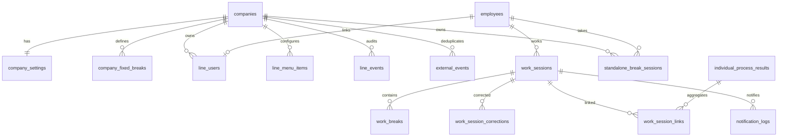

# Phase2A ER図・マイグレーション

## 自動移行

起動時に`src/schema.sql`の`CREATE TABLE/INDEX IF NOT EXISTS`を適用する。既存`work_sessions`へ`company_id`、`product_id`、`break_mode`がなければ`ALTER TABLE`で追加する。初期会社「とらいアンぐる」と会社設定を作成し、`company_id`が空の既存工数を初期会社へ更新する。

`line_events`は新規作成のみで既存イベントを推測移行しない。既存`external_events`は冪等制御履歴として保持する。秘密鍵、PIN、LINE識別情報の実データをマイグレーションへ埋め込まない。

## ロールバック上の注意

SQLiteの既存列削除を伴う自動ロールバックは用意しない。本番適用前にDBファイルを停止状態でバックアップし、問題時はバックアップDBへ戻す。
