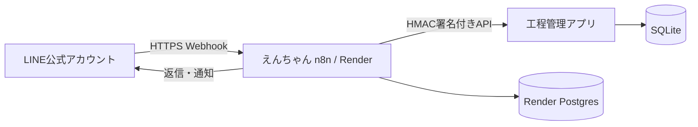

# Renderに「えんちゃん（n8n）」を設置する手順書

更新日: 2026-07-19

対象範囲: Renderへのn8n配置、初期設定、LINE公式アカウントとの接続準備、工程管理アプリへの安全な中継、試験、運用開始判定。

## 1. 完成後の構成



n8nはWebhook受付、LINE署名確認、中継、再送、通知、実行ログを担当する。作業状態や工数計算などの業務判断は工程管理アプリが担当する。

## 2. 最初に決めること

### 推奨する本番構成

- n8n: Renderの有料Web Service
- n8n保存先: Render Postgres
- リージョン: 工程管理アプリまたは主な利用地域に近い同一リージョン
- n8nイメージ: `latest`ではなく、動作確認済みバージョンへ固定

Render公式はPostgres方式を推奨している。永続ディスク方式は単純だが、有料インスタンスが必要で、ディスク接続中は水平スケールとゼロダウンタイム配備に制限がある。

### 無料構成の用途

無料構成は接続試験だけに使用する。Render公式情報では、無料Web Serviceは無通信時に休止し、無料Postgresには利用期限がある。作業開始・終了を確実に受ける本番運用には使用しない。

## 3. 事前に準備するもの

- Renderアカウント
- GitHubアカウント
- LINE公式アカウントとMessaging APIチャネル
- 公開HTTPSで到達できる工程管理アプリURL
- パスワード管理ツール
- 次の秘密値
  - n8n暗号化キー
  - LINE Channel Secret
  - LINE Channel Access Token
  - 工程管理アプリとn8nのHMAC共有秘密鍵

秘密値をGit、Markdown、スクリーンショット、チャットへ貼らない。

## 4. Renderへn8nを配置する

### 方法A: Postgres付きBlueprint（推奨）

1. [Render公式のn8n配置ガイド](https://render.com/docs/deploy-n8n)を開く。
2. ガイドに掲載されている`render-examples/n8n`テンプレートを自分のGitHubへ複製する。
3. リポジトリは原則Privateにする。
4. `render.yaml`でn8nのDockerイメージを確認し、検証後はバージョンタグまたはdigestへ固定する。
5. Render Dashboardで`New`→`Blueprint`を選ぶ。
6. 複製したGitHubリポジトリを接続する。
7. Blueprint名を`enchan-production`など識別しやすい名前にする。
8. 本番用ブランチを選択して`Deploy Blueprint`を実行する。
9. n8n Web ServiceとRender Postgresの両方が正常になったことを確認する。
10. 本番運用前に、Web ServiceとPostgresを継続利用できるプランへ変更する。

### 方法B: 永続ディスク

Postgresを使わない場合だけ選択する。

1. Render Dashboardで`New`→`Web Service`を選ぶ。
2. `Existing Image`から公式n8n Dockerイメージを指定する。
3. Free以外のインスタンスタイプを選ぶ。
4. `PORT=5678`を設定する。
5. AdvancedからDiskを追加する。
6. Mount pathを`/home/node`、初期サイズを1GB以上にする。
7. 配備後、再起動してもワークフローが残ることを確認する。

Renderでは永続ディスクのマウント先以外は再配備時に消える。ディスク方式では複数インスタンスへ拡張できず、配備時に短時間停止する可能性がある。

## 5. Render環境変数を設定する

Renderのn8n Web Serviceで`Environment`を開き、次を設定する。

|Key|値・用途|秘密|
|---|---|---|
|`PORT`|`5678`|いいえ|
|`WEBHOOK_URL`|`https://＜n8nのonrender.com URL＞/`|いいえ|
|`N8N_EDITOR_BASE_URL`|n8n管理画面のHTTPS URL|いいえ|
|`N8N_ENCRYPTION_KEY`|十分に長いランダム値。変更・紛失禁止|はい|
|`GENERIC_TIMEZONE`|`Asia/Tokyo`|いいえ|
|`TZ`|`Asia/Tokyo`|いいえ|
|`LINE_CHANNEL_SECRET`|LINE Developersで確認|はい|
|`LINE_CHANNEL_ACCESS_TOKEN`|LINE Developersで発行|はい|
|`MANUFACTURING_APP_BASE_URL`|工程管理アプリの公開HTTPS URL|いいえ|
|`WF_N8N_SHARED_SECRET`|工程管理アプリの`N8N_SHARED_SECRET`と同一|はい|

Blueprintが生成した`DB_POSTGRESDB_*`は削除・上書きしない。環境変数を保存したら`Save and deploy`を実行する。

`N8N_ENCRYPTION_KEY`を後から別の値へ変更すると、保存済みCredentialsを復号できなくなる。パスワード管理ツールへ保管し、バックアップ担当者を決める。

## 6. n8n初期設定

1. Renderに表示された`onrender.com` URLを開く。
2. n8nのOwnerアカウントを作成する。
3. 強固なパスワードを設定する。
4. Owner以外へ不要な管理権限を渡さない。
5. Settingsでタイムゾーンが東京になっていることを確認する。
6. ワークフローの失敗実行を確認できる担当者を決める。
7. 本番稼働前にn8nのSecurity Auditを実施する。

## 7. LINE用Credentials

可能なものはn8nのCredentialsへ登録し、ノードへ直接書かない。

- LINE Channel Access Token: HTTP Header AuthなどのCredentialとして登録
- LINE Channel Secret: LINE署名確認でのみ使用
- 工程管理アプリHMAC共有秘密鍵: HMAC生成処理でのみ使用

実行ログへAccess Token、Channel Secret、共有秘密鍵、登録コードを出力しない。

## 8. LINE受付ワークフローを作る

ワークフロー名例: `LINE_工程打刻_本番`

推奨ノード順:

1. Webhook
2. LINE署名確認
3. Webhookイベント分割
4. LINE入力を工程管理アプリ形式へ変換
5. EventID・送信時刻・本文を作成
6. HMAC-SHA256署名を生成
7. HTTP Requestで工程管理アプリを呼ぶ
8. 応答をLINEメッセージへ変換
9. LINE Reply APIを呼ぶ
10. Respond to Webhook
11. エラー処理・管理者通知

### Webhookノード

- Method: `POST`
- Path: 推測されにくい専用名
- Respond: LINEの応答期限に間に合う構成
- 本番URLを使用し、Test URLをLINE Developersへ登録しない

LINE Webhookの`x-line-signature`は、受信した本文の生文字列をChannel SecretでHMAC-SHA256計算し、Base64化した値と照合する。JSON変換、改行変更、再シリアライズより前に検証する。n8n上で生本文を保持できない構成の場合は本番接続を中止し、前段の署名検証用受信サービスを用意する。

### EventID

LINE Webhook Event IDを優先する。存在しない管理イベントでは、同一再送で変化しない決定的IDを作る。再送のたびに新しい乱数を発行してはいけない。

### 工程管理アプリ向けHMAC

次の文字列を署名対象とする。

```text
eventId.timestamp.rawBody
```

HMAC-SHA256の16進文字列を生成し、API専用仕様書に定める3ヘッダーを付ける。本文と署名計算に使った文字列を完全一致させる。

### LINE返信

工程管理アプリの`state`に応じて表示を変える。

- `idle`: 作業選択メニュー
- `submenu`: 青果加工（ねぎ、きゅうり）または納品準備・納品（納品準備、納品、外回り、その他業務）
- `working`: 現在工程、終了
- `break`: 休憩中、終了
- `error`: 本人向け案内と管理者通知

LINE Reply APIはWebhookの`replyToken`を使う。後続の未終了通知はPush APIを使う。

## 9. 未終了確認ワークフロー

ワークフロー名例: `LINE_未終了確認_本番`

1. Schedule Triggerを作成する。
2. 標準終業時刻＋猶予後に実行する。
3. EventID、送信時刻、本文を作る。
4. HMAC署名付きで未終了確認APIを呼ぶ。
5. 返された対象者本人へPush通知する。
6. 管理者へ対象者一覧を通知する。
7. 通知失敗を記録する。

未終了作業をn8n側で自動終了しない。

## 10. LINE Developers Consoleを設定する

1. 対象のProviderとMessaging APIチャネルを開く。
2. Messaging APIタブでChannel Access Tokenを発行する。
3. n8n WebhookノードのProduction URLをWebhook URLへ設定する。
4. `Verify`を実行して成功を確認する。
5. `Use webhook`をONにする。
6. LINE Official Account Manager側の応答メッセージを確認し、n8nとの二重返信を防ぐ。
7. テスト担当者だけが友だち追加する。

LINEはHTTPSかつ一般的に信頼された証明書を要求する。Renderの`onrender.com` URLはHTTPSで提供される。

## 11. 接続試験

次の順番で管理者1名が試験する。

|No.|操作|期待結果|
|---|---|---|
|1|LINE DevelopersのVerify|Success|
|2|未登録LINEからメッセージ|登録コード案内|
|3|管理画面でコード発行し送信|従業員として登録|
|4|れんこん水煮を開始|作業中表示|
|5|別工程を開始|拒否|
|6|作業中に休憩開始|作業終了を案内して拒否|
|7|作業終了後に休憩開始|休憩中表示|
|8|休憩中に別工程開始|休憩終了を案内して拒否|
|9|休憩終了|待機表示。休憩は労務時間へ含めない|
|9|同じEventIDを再送|二重登録なし|
|10|不正署名で送信|拒否・監査ログ保存|
|11|青果加工|ねぎ・きゅうりのサブメニュー表示|
|12|納品準備・納品|編集済みサブメニュー表示。配達は納品、仕入れは外回りへ集約|
|12|終了せず猶予超過|本人・管理者へ警告|
|13|管理画面で理由付き訂正|訂正前後と理由が保存|
|14|加工実績入力|一致するLINE工数候補を選択可能|

## 12. 本番開始判定

以下をすべて満たしてから従業員へ案内する。

- n8nとPostgresが本番向けプラン
- n8nバージョン固定済み
- WEBHOOK_URLが本番URL
- LINE署名確認が生本文で成功
- 工程管理アプリ向けHMACが成功
- EventID再送で二重登録なし
- エラー通知先が管理者へ届く
- n8nとDBのバックアップ・復旧担当者が決定
- 管理者PINと秘密鍵がパスワード管理ツールへ保管済み
- 管理者1名による一連の試験完了

## 13. 日常運用

### 毎日

- n8n Executionsで失敗実行を確認
- 未終了通知の処理状況を確認
- 工程管理アプリの`line_events`でエラー・重複を確認

### n8n更新時

1. リリースノートを確認する。
2. 現在のバージョンとDBをバックアップする。
3. 検証環境でLINE登録、開始、休憩、終了、再送を試す。
4. 本番イメージの固定バージョンを更新する。
5. 異常時は直前のイメージとDBへ戻す。

### 秘密値を変更した場合

- LINE TokenまたはChannel Secret変更: n8n側を同時更新
- HMAC共有秘密鍵変更: n8nと工程管理アプリを同時更新
- `N8N_ENCRYPTION_KEY`: 通常のローテーション手順なしに変更しない

## 14. よくある問題

### LINE Verifyが失敗する

- Production URLではなくTest URLを設定していないか
- ワークフローがActiveか
- n8nが無料休止中ではないか
- LINE署名確認前に本文をJSON化していないか
- 2秒以内に応答できているか

### n8n再配備後にワークフローが消えた

- Postgres接続変数が外れていないか
- SQLite方式の場合、`/home/node`へ永続ディスクを付けたか

### 工程管理アプリが署名不正を返す

- n8nとアプリの共有秘密鍵が同じか
- EventID、timestamp、実送信本文の連結順が正しいか
- HMAC計算後に本文を変更していないか
- Renderとアプリの時刻差が許容範囲内か

### LINEで二重返信される

- LINE Official Account Managerの自動応答とn8n返信が同時に有効になっていないか

## 15. 公式資料

- [Render: Deploy n8n on Render](https://render.com/docs/deploy-n8n)
- [Render: Environment Variables and Secrets](https://render.com/docs/configure-environment-variables)
- [Render: Persistent Disks](https://render.com/docs/disks)
- [n8n Documentation](https://docs.n8n.io/)
- [n8n Security Audit](https://docs.n8n.io/hosting/securing/security-audit/)
- [LINE: Build a bot](https://developers.line.biz/en/docs/messaging-api/building-bot/)
- [LINE: Verify webhook signature](https://developers.line.biz/en/docs/messaging-api/verify-webhook-signature/)
- [LINE: Verify webhook URL](https://developers.line.biz/en/docs/messaging-api/verify-webhook-url/)

## 16. 本プロジェクトの関連資料

- `14-phase2a-line-n8n-operations.md`
- `15-phase2a-api-specification.md`
- `16-phase2a-er-and-migration.md`
- `SETUP.md`
